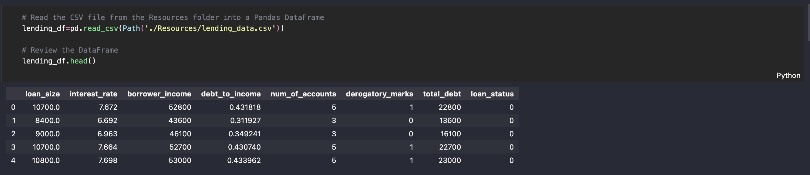
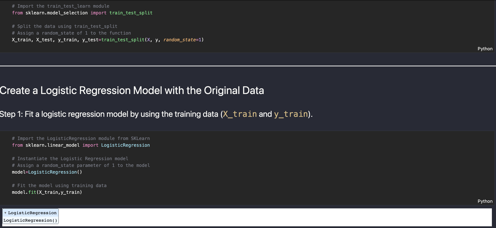
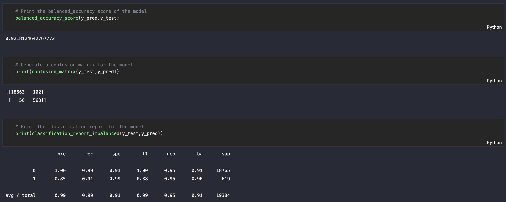
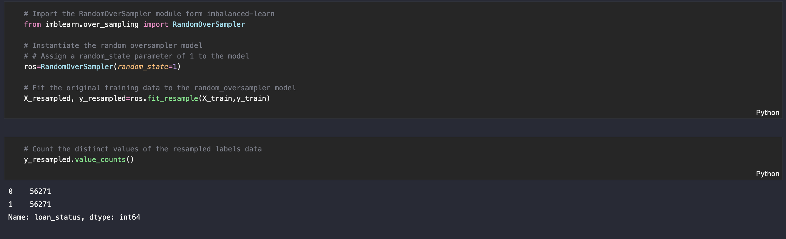
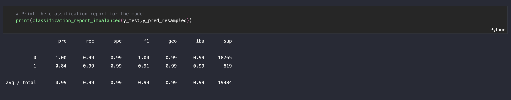

# *Credit risk classification*
---

**Welcome to my repository for the credit risk classification. Please explore the codebase!** <br />

---
## Analytical Summary

This project presents a classification model that identifies creditworthiness of borrowers. 

---

## Technologies

This project leverages python 3.7 with the following packages:

* [pandas](https://pandas.pydata.org) - Library for reading/writing csv files and fast manipulation with DataFrames.

* [numpy](https://numpy.org/) - Library for working with arrays.

* [pathlib](https://docs.python.org/3/library/pathlib.html) - Library for filesystem paths.

* [sklearn](https://scikit-learn.org/stable/) - Library for predictive-data analysis.

* [imblearn](https://imbalanced-learn.org/stable/) - Library for working with imbalanced classes.
---

## Installation Guide

Before running the application first install the following dependencies.

```python

from imblearn.metrics import classification_report_imbalanced
import warnings

  pip install pandas
  pip install numpy
  pip install pathlib
  pip install -U scikit-learn
  pip install imblearn

```
---

## Usage

To use this project simply clone the repository and run the code **credit_risk_resampling.ipynb** in JupyterLab or in VS Code.

---

## Methodologys
This script uses classification model, logistic regression model, to predict creditworthiness of borrowers. The algorithm overcomes the problem with imbalanced classes by resampling the training set.
The dataset takes on the following form:



The first model runs on the randomly spit training/testing datasets without resampling.



The accuracy measures indicate quite a high forecasting accuracy for this first model:



The second model runs on the resampled dataset:


and also proves to be very accurate:


---

## License

MIT

---


 
